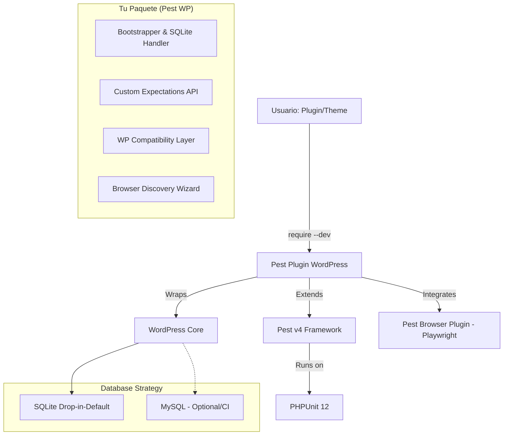

# Project Blueprint: Pest Plugin for WordPress

**Estado:** Fase 1 Completada ✅ (Dic 2025)  
**Objetivo:** Modernizar la Developer Experience (DX) del testing en WordPress.

## 1. Resumen Ejecutivo

El objetivo es crear un paquete de Composer (`pest-plugin-wordpress`) que actúe como el puente definitivo entre **PEST v4** y el ecosistema de WordPress.

Actualmente, configurar tests en WordPress es complejo debido a la incompatibilidad entre las versiones modernas de PHPUnit (requeridas por Pest) y la suite de pruebas legacy de WordPress. Este paquete busca ofrecer una experiencia "Zero-Config" que solucione internamente estos conflictos de dependencias, utilizando **SQLite** por defecto para una ejecución ultrarrápida sin configuración de servidores.

## 2. Objetivos Principales

- **Simplicidad Radical (SQLite First):** Instalación y ejecución inmediata sin necesidad de Docker o MySQL local para tests de integración.
- **Sintaxis Expresiva:** Llevar la API de expectativas (`expect()`) de Pest al mundo de WP.
- **Forward-Only Strategy:** Soportar únicamente PHP 8.3+ y PHPUnit 12+ (sin retrocompatibilidad con versiones anteriores).
- **Browser Testing Agnóstico:** Soportar Playwright conectándose a cualquier entorno local (wp-env, LocalWP, DDEV) sin forzar una herramienta específica.

## 3. Arquitectura y Dependencias

El paquete funcionará como una capa intermedia que abstrae la complejidad de la Test Suite nativa de WordPress y sus polyfills.

### Diagrama de Dependencias



### Decisión de Arquitectura: Sin Yoast PHPUnit Polyfills

**Contexto:** Los Yoast PHPUnit Polyfills (`yoast/phpunit-polyfills:^4.0`) permiten escribir tests compatibles con múltiples versiones de PHPUnit (7.5 - 12.x). Sin embargo, para este proyecto hemos decidido **no incluirlos** por las siguientes razones:

1. **Forward-Only Strategy:** Solo soportamos PHP 8.3+ y PHPUnit 12+. No necesitamos retrocompatibilidad con versiones anteriores de PHPUnit.

2. **WordPress Test Suite No Utilizada:** No dependemos de `WP_UnitTestCase` ni del test framework legacy de WordPress. En su lugar, creamos nuestro propio bootstrap que carga WordPress directamente.

3. **Simplicidad:** Menos dependencias = menos superficie de conflictos y mantenimiento más sencillo.

4. **Pest v4 Native:** Pest v4 ya está diseñado para PHPUnit 12 y proporciona todas las aserciones modernas que necesitamos.

**Alternativa Implementada:**
- Bootstrap propio en `src/bootstrap.php` que carga WordPress con SQLite
- `TestCase` base simple que no extiende clases legacy de WP
- Transacciones de base de datos manejadas manualmente (rollback por test)

**Cuándo reconsiderar:**
- Si en el futuro necesitamos soportar versiones anteriores de PHP/PHPUnit
- Si queremos reutilizar factories de `WP_UnitTestCase` (en ese caso, crear wrappers propios)

### Matriz de Compatibilidad Objetivo

| Componente | Versión Soportada | Notas |
| :--- | :--- | :--- |
| **PHP** | 8.3+ | Requisito estricto de Pest v4 y PHPUnit 12. |
| **PEST** | v4.x | Uso nativo de Plugins, Arch y Browser (Playwright). |
| **PHPUnit** | 12.x | Requerido por Pest v4. |
| **Database** | SQLite / MySQL | SQLite manejado internamente por el paquete. |
| **WordPress** | 6.5+ | Enfocado en versiones con soporte de PHP 8.x. |

## 4. Funcionalidades Detalladas

### A. Core & Setup (SQLite First Strategy)

- **Instalador Inteligente (`pest:install-wp`):**
    1. Descarga el Core de WP a `.pest/wordpress`.
    2. Instala el drop-in de SQLite (`db.php`) automáticamente desde `sqlite-database-integration` de WordPress.
    3. Configura WordPress para usar SQLite.
    - **Resultado:** El usuario corre `pest` y funciona sin instalar nada más.
- **Bootstrap Propio:** Una función `bootstrap()` en `src/bootstrap.php` que carga WordPress con la configuración correcta para testing.

### B. Expectations (Domain Specific Language)

Extender `expect()` para entender objetos de WP:

- **Post & Query:** `expect($post)->toBePublished()`, `expect($query)->toHavePosts()`.
- **User & Auth:** `expect($user)->toBeAdministrator()`, `expect($user)->can('edit_posts')`.
- **Hooks & Errors:** `expect('init')->toHaveAction('my_callback')`, `expect($result)->toBeWPError()`.

### C. Browser Testing (Environment Agnostic)

- **Discovery Wizard:** Al instalar, preguntar al usuario: "¿Cuál es la URL de tu entorno local?" (LocalWP, wp-env, Valet, etc.).
- **Zero-Login Setup:** Utilizar `storageState` de Playwright para loguearse una sola vez en la URL proporcionada.
- **Selectores Resilientes:** Helpers para encontrar elementos de WP independientemente del tema o configuración.

## 5. Roadmap y Lista de Tareas Detallada

### Fase 1: Infraestructura y Compatibilidad (El Núcleo)
**Objetivo:** Lograr que un test vacío corra sin errores usando SQLite.

#### 1.1 Project Scaffolding
- [x] Inicializar repositorio con estructura de paquete Composer (`src/`, `tests/`, `composer.json`).
- [x] Definir dependencias require: `pestphp/pest:^4.0` (sin polyfills de Yoast - no necesarios para PHPUnit 12 forward-only).
- [x] Configurar CI básico (GitHub Actions) que corra solo en PHP 8.3+.

#### 1.2 Test Bootstrap & SQLite Handler
- [x] **Bootstrapper:** Crear script que descargue WP Core a `.pest/wordpress` si no existe.
- [x] **SQLite Drop-in:** Implementar lógica para descargar `sqlite-database-integration` de WordPress y copiar el drop-in de SQLite (`db.php`) al directorio `wp-content/`.
- [x] **Config Generator:** Generar un `wp-tests-config.php` dinámico que apunte a la DB SQLite.
- [x] **Bootstrap propio:** Crear `src/bootstrap.php` con función `bootstrap()` que carga WordPress sin depender de WP_UnitTestCase.

#### 1.3 Database Automator
- [x] La verificación de integridad de DB SQLite se hace al correr el bootstrap (instalación automática si no existe).
- [ ] Soportar fallback a MySQL mediante variables de entorno en `phpunit.xml` (para entornos legacy o CI estricto).

#### 1.4 Integration PoC
- [x] Escribir el primer test de integración: `it('loads wordpress option', function() { expect(get_option('siteurl'))->not->toBeEmpty(); });`.
- [x] Verificar que WordPress + SQLite funciona correctamente (wp_insert_post, get_post, etc.).
- [ ] Implementar rollback de transacciones para aislamiento de tests (Fase 2).

### Fase 2: Developer Experience & Syntax Sugar
**Objetivo:** Que el usuario prefiera usar tu paquete a escribir PHPUnit puro.

#### 2.1 Pest Plugin Hooks
- [ ] Implementar el Plugin de Pest (`Pest\Plugin`) para inyectar configuración global.
- [ ] **Autoloading:** Hacer que `uses(PestWP\TestCase::class)->in('tests/WP')` funcione automáticamente en el `Pest.php` generado.

#### 2.2 Factories Wrapper
- [ ] Crear helper global `create_post(array $args = [])`.
- [ ] Crear helper global `create_user(string $role = 'subscriber')`.
- [ ] **Subtarea:** Asegurar que estos helpers retornen objetos `WP_Post`/`WP_User` en lugar de IDs numéricos.

#### 2.3 Auth Helpers
- [ ] Implementar `loginAs($user_id)` que simule la cookie de auth de WP.
- [ ] Verificar permisos: `expect($user)->can('manage_options')->toBeTrue()`.

#### 2.4 Custom Expectations (The Fun Part)
- [ ] **WP_Error:** `expect($result)->toBeWPError()`.
- [ ] **Posts:** `expect($post)->toBePublished()`, `expect($post)->toBeDraft()`, `expect($post)->toHaveMeta('key', 'val')`.
- [ ] **Actions/Filters:** `expect('init')->toHaveAction('my_function')`.

### Fase 3: Browser Testing (Pest v4 + Playwright)
**Objetivo:** Tests E2E estables sobre cualquier entorno local.

#### 3.1 Wizard de Configuración
- [ ] Crear comando interactivo `pest:setup-browser`:
    - Preguntar Base URL (ej. `http://my-site.local`).
    - Preguntar Credenciales de Admin (o intentar crearlas si hay acceso a CLI).
    - Generar/Actualizar `pest.php` con `browser()->baseUrl(...)`.

#### 3.2 Authentication Strategy
- [ ] Crear un script `global-setup.ts` para Playwright.
- [ ] Implementar lógica de login única y guardado de `storageState.json`.

#### 3.3 WP Admin Locators & Helpers
- [ ] Crear Trait `InteractsWithWordPress` para el Browser.
- [ ] Implementar `visitAdmin(string $page)`.
- [ ] Implementar `clickAdminMenu(string $menuName)`.

### Fase 4: Tooling, Documentación y Lanzamiento
**Objetivo:** Pulir el producto para consumo público.

#### 4.1 Architecture Presets
- [ ] Crear preset `arch()->preset()->wordpress()`.
- [ ] **Regla:** Prohibir `dd()`, `var_dump()` y `global $wpdb`.

#### 4.2 Documentación
- [ ] Escribir README con ejemplos de configuración para LocalWP, DDEV y wp-env.
- [ ] Documentar la estrategia de SQLite vs MySQL.

#### 4.3 CI/CD Templates
- [ ] Crear archivo `.github/workflows/wp-tests.yml` de ejemplo usando la estrategia SQLite (muy rápido en CI).

## 6. Desarrollo Interno del Paquete (Meta-Testing)

Esta sección define las herramientas y dependencias que usaremos para desarrollar y testear este paquete. El estándar de calidad debe ser máximo (level: max).

### 6.1 composer.json (Snippet de referencia)

```json
"require": {
    "php": "^8.3",
    "pestphp/pest": "^4.0"
},
"require-dev": {
    "pestphp/pest-plugin-type-coverage": "^4.0",
    "phpstan/phpstan": "^2.1",
    "php-stubs/wordpress-stubs": "^6.9",
    "laravel/pint": "^1.18",
    "rector/rector": "^2.0",
    "symfony/var-dumper": "^7.1",
    "mockery/mockery": "^1.6"
},
"scripts": {
    "test": "pest",
    "test:coverage": "pest --coverage",
    "test:types": "pest --type-coverage",
    "lint": "pint --test",
    "lint:fix": "pint",
    "analyse": "phpstan analyse --memory-limit=512M",
    "refactor": "rector"
}
```

### 6.2 Explicación de Herramientas

- **`pestphp/pest:^4.0`**: Framework de testing principal. Usamos Pest para testear nuestro plugin de Pest (Inception!).
- **`phpstan/phpstan:^2.1`**: Análisis estático estricto. **Objetivo:** Level 9 (Max). Es crucial para asegurar que nuestros helpers y expectations manejan correctamente los tipos difusos de WordPress (`false|WP_Error|int`).
- **`php-stubs/wordpress-stubs:^6.9`**: Stubs de WordPress para PHPStan. Proporciona definiciones de tipos para funciones y clases de WordPress.
- **`pestphp/pest-plugin-type-coverage`**: Plugin oficial de Pest para verificar que tenemos el 100% de tipos definidos en nuestro código.
- **`laravel/pint`**: Linter de código basado en PHP-CS-Fixer pero con configuración cero. Mantiene el estilo PSR-12 automáticamente.
- **`rector/rector`**: Herramienta de refactorización automática. Nos ayudará a mantener el paquete compatible con futuras versiones de PHP.
- **`symfony/var-dumper`**: Imprescindible para debugear durante el desarrollo (`dd()`).
- **`mockery/mockery`**: Aunque Pest tiene mocks, Mockery es necesario a veces para simular comportamientos complejos de clases legacy de WordPress.

### 6.3 Nota sobre Yoast PHPUnit Polyfills

**NO usamos `yoast/phpunit-polyfills`** en este proyecto. Los polyfills de Yoast son útiles cuando necesitas mantener compatibilidad con múltiples versiones de PHPUnit (7.5 - 12.x), pero:

1. Solo soportamos PHP 8.3+ y PHPUnit 12+ (forward-only strategy)
2. No extendemos `WP_UnitTestCase` - tenemos nuestro propio bootstrap
3. Pest v4 ya proporciona todo lo necesario para PHPUnit 12

Si en el futuro necesitamos retrocompatibilidad, los polyfills de Yoast v4.0 son compatibles con PHPUnit 12 y podrían añadirse sin conflictos.
